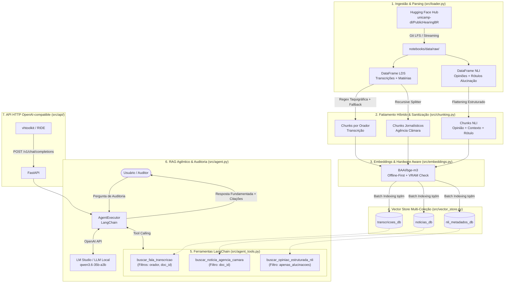

# 🏛️ Arquitetura e Especificação Técnica: RAG Agêntico de Auditoria Documental

> **Hackathon Ideias em Rede — 1ª Edição (Instituto Kunumi)**  
> **Domínio:** Auditoria Parlamentar e Verificação de Fidelidade Documental  
> **Dataset Base:** [`unicamp-dl/PublicHearingBR`](https://huggingface.co/datasets/unicamp-dl/PublicHearingBR) (Hugging Face)  
> **Tecnologias Centrais:** Python 3.10+, LangChain, ChromaDB, BAAI/bge-m3, LM Studio (OpenAI-compatible)

---

## 1. Visão Geral e Contexto do Projeto

Este repositório contém a arquitetura completa e a implementação do **RAG Agêntico de Auditoria Parlamentar**, desenvolvido no âmbito do **Hackathon Ideias em Rede (1ª Edição - Instituto Kunumi)**.

O objetivo do sistema é auditar, correlacionar e consultar transcrições taquigráficas oficiais de audiências públicas da Câmara dos Deputados do Brasil, contando-as com matérias jornalísticas produzidas pela Agência Câmara e metadados estruturados de NLI (*Natural Language Inference*), permitindo identificar **fidelidade documental**, **distorções narrativas** e **alucinações factuais**.

### As Duas Frentes do Dataset `PublicHearingBR`:

```
                    ┌────────────────────────────────────────────────────────┐
                    │            unicamp-dl/PublicHearingBR                  │
                    └───────────────────────────┬────────────────────────────┘
                                                │
                 ┌──────────────────────────────┴──────────────────────────────┐
                 ▼                                                             ▼
┌─────────────────────────────────┐                           ┌─────────────────────────────────┐
│     Frente LDS (Summarization)   │                           │          Frente NLI             │
├─────────────────────────────────┤                           ├─────────────────────────────────┤
│ • Transcrições longas oficiais  │                           │ • Opiniões extraídas de oradores│
│   da Taquigrafia da Câmara      │                           │ • Rótulos de alucinação manual  │
│ • Matérias jornalísticas        │                           │ • Comparativo com GPT-4o-mini   │
│   resumidas (Agência Câmara)    │                           │ • Chunks de contexto próximos   │
│ • Metadados de audiência        │                           │ • Metadados de orador e cargo   │
└─────────────────────────────────┘                           └─────────────────────────────────┘
```

1. **Frente LDS (*Long Document Summarization*):**
   - Transcrições na íntegra de audiências públicas com dezenas de oradores e milhares de palavras.
   - Matérias jornalísticas cobrindo cada audiência.
   - Metadados formais: `id`, `assunto`, data, número da reunião, comissão e participantes.
2. **Frente NLI (*Natural Language Inference*):**
   - Extração estruturada de declarações e opiniões individuais de deputados e convidados.
   - Rótulos de *Ground Truth* de verificação manual de alucinação (`True` = afirmação fiel/sustentada; `False` = alucinação/não sustentada na íntegra).
   - Anotações automatizadas de 3 variações de prompts utilizando GPT-4o-mini.
   - Trechos textuais da transcrição (`chunks_proximos`) que contextualizam a opinião anotada.

---

## 2. Arquitetura Geral do Sistema & Fluxo de Dados

O pipeline foi projetado sob o princípio da **Abordagem Híbrida**: preserva o contexto natural do debate parlamentar dividindo falas por orador e indexa os dados em três bases vetoriais independentes para alimentar um **Agente Executor com Tool Calling**.



---

## 3. Árvore de Diretórios e Estrutura de Arquivos

Abaixo está a estrutura oficial do repositório. Toda a persistência de dados brutos e bancos de vetores reside centralizada em `notebooks/data/`, mantendo a raiz do projeto estritamente voltada a código, documentação, configurações e testes:

```
knownledge Lab/
├── .gitignore                      # Regras de exclusão Git (venv, bancos SQLite, caches)
├── ARCHITECTURE.md                 # [Este Arquivo] Documento mestre de arquitetura e contexto
├── requirements.txt                # Dependências versionadas do projeto Python
├── pytest.ini                      # pythonpath da raiz para testes da API
├── test_step2.py                   # Validador CLI do pipeline de chunking e metadados
├── test_step3.py                   # Validador CLI das ferramentas vetoriais e Tool Calling
├── tests/                          # Testes automatizados (API HTTP, mapper OpenAI)
│   ├── test_openai_compat.py
│   └── test_api.py
├── src/                            # Módulos Python com as regras de negócio do sistema
│   ├── __init__.py                 # Inicializador do pacote e metadados de versão (v0.1.0)
│   ├── loader.py                   # Download Git LFS, parsing JSONL e desaninhamento NLI
│   ├── chunking.py                 # Chunking híbrido (Regex de oradores, notícias, NLI)
│   ├── embeddings.py               # Instanciação do BAAI/bge-m3 com hardware-awareness
│   ├── vector_store.py             # Cliente ChromaDB e rotina de indexação em lotes
│   ├── agent_tools.py              # Ferramentas LangChain (@tool) com filtros dinâmicos
│   ├── agent.py                    # Agente RAG, System Prompt de auditoria e AgentExecutor
│   └── api/                        # Servidor HTTP OpenAI-compatible (FastAPI)
│       ├── app.py                  # Rotas /health, /v1/models, /v1/chat/completions
│       ├── config.py               # Variáveis de ambiente
│       ├── openai_compat.py        # Modelos Pydantic e mapper messages → agente
│       └── __main__.py             # python -m src.api
└── notebooks/                      # Notebooks Jupyter com análises visuais e demonstrações
    ├── 01_eda_public_hearing.ipynb # EDA, métricas de tokens, compressão e gráficos NLI
    ├── 02_vector_store_indexing.ipynb # Indexação completa no ChromaDB e testes de busca
    ├── 03_rag_agent_chat.ipynb     # Casos de uso de auditoria e chatbot interativo
    └── data/                       # Diretório centralizado e oficial de persistência
        ├── raw/                    # Datasets brutos baixados do Hugging Face Hub
        │   ├── PublicHearingBR_LDS.jsonl (25 MB)
        │   └── PublicHearingBR_NLI.jsonl (56 MB)
        └── processed/              # Artefatos processados e persistidos
            └── chroma_db/          # Banco vetorial persistente ChromaDB (3 coleções)
                ├── chroma.sqlite3
                └── [pastas UUID com índices vetoriais HNSW]
```

---

## 4. Responsabilidade Detalhada de Cada Arquivo

| Arquivo / Módulo | Camada / Papel | Responsabilidade Principal |
| :--- | :--- | :--- |
| [`ARCHITECTURE.md`](file:///home/rpcosta/C%C3%B3digos/knownledge%20Lab/ARCHITECTURE.md) | Documentação | Guia mestre de arquitetura, decisões técnicas, esquema do banco de dados e especificações. |
| [`requirements.txt`](file:///home/rpcosta/C%C3%B3digos/knownledge%20Lab/requirements.txt) | Infraestrutura | Lista de dependências Python com restrições de versão (LangChain, ChromaDB, PyTorch, etc.). |
| [`.gitignore`](file:///home/rpcosta/C%C3%B3digos/knownledge%20Lab/.gitignore) | Infraestrutura | Ignora ambientes virtuais (`.venv`), binários de embeddings, arquivos SQLite e caches Python. |
| [`test_step2.py`](file:///home/rpcosta/C%C3%B3digos/knownledge%20Lab/test_step2.py) | Teste / CLI | Carrega 1 amostra de LDS e NLI, executa o fatiamento e inspeciona os metadados dos chunks gerados. |
| [`test_step3.py`](file:///home/rpcosta/C%C3%B3digos/knownledge%20Lab/test_step3.py) | Teste / CLI | Testa as 3 `@tool` offline contra o ChromaDB e avalia a conectividade/Tool Calling com a LLM. |
| [`src/__init__.py`](file:///home/rpcosta/C%C3%B3digos/knownledge%20Lab/src/__init__.py) | Pacote | Inicializador do pacote Python `src`, definindo `__version__ = "0.1.0"`. |
| [`src/loader.py`](file:///home/rpcosta/C%C3%B3digos/knownledge%20Lab/src/loader.py) | Ingestão | Download automático via Hugging Face Hub (Git LFS), parsing JSONL e *flattening* da base NLI. |
| [`src/chunking.py`](file:///home/rpcosta/C%C3%B3digos/knownledge%20Lab/src/chunking.py) | Pré-Processamento | Segmentação por orador via Regex, chunking jornalístico e sanitização de tipos para ChromaDB. |
| [`src/embeddings.py`](file:///home/rpcosta/C%C3%B3digos/knownledge%20Lab/src/embeddings.py) | IA / Modelos | Gestão do `BAAI/bge-m3`, checagem de VRAM livre da GPU, fallback CPU/MPS e cache offline. |
| [`src/vector_store.py`](file:///home/rpcosta/C%C3%B3digos/knownledge%20Lab/src/vector_store.py) | Persistência | Cliente `chromadb.PersistentClient`, indexação em lotes idempotente com barra de progresso. |
| [`src/agent_tools.py`](file:///home/rpcosta/C%C3%B3digos/knownledge%20Lab/src/agent_tools.py) | Ferramentas | 3 ferramentas LangChain (`@tool`), filtros dinâmicos (`$and`) e sanitização anti-Jinja. |
| [`src/agent.py`](file:///home/rpcosta/C%C3%B3digos/knownledge%20Lab/src/agent.py) | Orquestração | Fábrica do Agente RAG (`create_rag_agent`), System Prompt com 5 regras de auditoria cruzada. |
| [`src/api/`](src/api/) | API HTTP | FastAPI OpenAI-compatible para o vhtoolkit (RIDE) consumir o agente sem alterar o Unity. |
| [`tests/`](tests/) | Teste | `pytest` da API com `TestClient` e agente mockado. |
| [`notebooks/01_eda_public_hearing.ipynb`](file:///home/rpcosta/C%C3%B3digos/knownledge%20Lab/notebooks/01_eda_public_hearing.ipynb) | Análise / EDA | Distribuição de tokens (`tiktoken`), taxa de compressão, gráficos de alucinação e deputados. |
| [`notebooks/02_vector_store_indexing.ipynb`](file:///home/rpcosta/C%C3%B3digos/knownledge%20Lab/notebooks/02_vector_store_indexing.ipynb) | Engenharia de Dados | Fatiamento completo das 2 bases, vetorização em GPU/CPU e testes de sanidade com queries semânticas. |
| [`notebooks/03_rag_agent_chat.ipynb`](file:///home/rpcosta/C%C3%B3digos/knownledge%20Lab/notebooks/03_rag_agent_chat.ipynb) | Demonstração | Execução dos 3 casos de uso do Agente Auditor e implementação de Chatbot Interativo. |

---

## 5. Técnicas de NLP, Algoritmos e Decisões de Engenharia

### 5.1. Ingestão Robusta e Parsing Estruturado (`src/loader.py`)
- **Git LFS via `huggingface_hub`:** A função `download_public_hearing_dataset()` utiliza `hf_hub_download(repo_type="dataset")`, garantindo download direto de ponteiros Git LFS sem corromper arquivos JSONL volumosos (>50MB).
- **Auto-Resolução de Caminhos (`_resolve_raw_dir`):** Busca os arquivos automaticamente em `notebooks/data/raw/` ou caminhos relativos equivalentes, permitindo que scripts na raiz ou dentro de `notebooks/` rodem sem alterar parâmetros.
- **Desaninhamento (*Flattening*) NLI:** O método `load_nli_data(flatten=True)` explode o JSON hierárquico (`amostra -> envolvidos -> opiniões -> verificações`) em um DataFrame tabular onde cada linha representa uma declaração atômica com seus respectivos contextos e rótulos de alucinação manual e sintética (Prompts 1, 2 e 3 do GPT-4o-mini).
- **Métricas Descritivas Calculadas em Tempo de Carga:** Contagem de caracteres, contagem de palavras e cálculo da razão de compressão (`compression_ratio = palavras_transcricao / palavras_materia`).

### 5.2. Fatiamento Híbrido por Orador & Sanitização de Tipos (`src/chunking.py`)
- **Regex Taquigráfica Especializada (`SPEAKER_HEADER_RE`):**
  ```python
  SPEAKER_HEADER_RE = re.compile(
      r'(?:\n|^)\s*'
      r'((?:O\s+SR\.|A\s+SRA\.|O\s+CONVIDADO|A\s+CONVIDADA|O\s+MINISTRO|A\s+MINISTRA|O\s+DEPUTADO|A\s+DEPUTADA|SR\.|SRA\.)'
      r'[^(\n\-:]*(?:\([^)]*\)[^(\n\-:]*)*)'
      r'\s*[\-:]\s*',
      re.IGNORECASE
  )
  ```
  *Decisão de Engenharia:* Captura prefixos formais da Taquigrafia da Câmara dos Deputados, identificando oradores, deputados, ministros e convidados, além de suportar estruturas complexas entre parênteses com hífens (ex: `O SR. PRESIDENTE (Lucas Redecker. Bloco/PSDB - RS) -`).
- **Chunking Híbrido com Fallback Recursivo:** 
  - Cada fala completa do orador constitui um documento atômico, preservando a linha de raciocínio.
  - Se uma fala isolada exceder `max_tokens=800` (~3.200 caracteres), aciona automaticamente o `RecursiveCharacterTextSplitter` com sobreposição de 150 tokens para que nenhuma janela semântica estoure a atenção da LLM.
- **Sanitização de Metadados (`_sanitize_metadata_value`):**
  - O ChromaDB rejeita tipos complexos e valores `None`/`NaN`. A função converte nulos em strings vazias ou booleanos explícitos, garantindo indexação limpa e sem exceções.

### 5.3. Modelo de Embeddings com Hardware Awareness (`src/embeddings.py`)
- **Modelo Escolhido: `BAAI/bge-m3`:** Modelo multilíngue de última geração com suporte a 8.192 tokens de contexto, ideal para textos jurídicos e parlamentares em português.
- **Verificação Dinâmica de VRAM (Limiar de 3.5 GB):**
  ```python
  if torch.cuda.is_available():
      free_mem, _ = torch.cuda.mem_get_info()
      free_gb = free_mem / (1024 ** 3)
      if free_gb >= 3.5:
          device = "cuda"
      else:
          device = "cpu"  # Fallback seguro para evitar CUDA Out Of Memory
  ```
- **Carregamento *Offline-First*:** Tenta carregar primeiro com `local_files_only=True` via cache local do Hugging Face. Se o modelo não estiver em disco, faz o download sob demanda com fallback seguro.
- **Normalização de Vetores:** `normalize_embeddings=True` permite o cálculo eficiente de similaridade por produto escalar / distância cosseno.
- **Cache LRU:** O decorador `@lru_cache(maxsize=1)` garante que o modelo de embedding seja carregado apenas uma vez na memória durante todo o ciclo de vida do processo.

### 5.4. Vector Store Multi-Coleção & Idempotência (`src/vector_store.py`)
- **3 Coleções Especializadas:**
  1. `transcricoes_db`: Falas dos oradores na íntegra.
  2. `noticias_db`: Cobertura jornalística da Agência Câmara.
  3. `nli_metadados_db`: Opiniões estruturadas, contextos próximos e rótulos de fidelidade/alucinação.
- **Indexação Idempotente e em Lotes (`batch_size=100`):**
  - Se a coleção no ChromaDB já tiver a contagem de documentos completa, a indexação é ignorada instantaneamente, poupando tempo de inferência de embeddings.
  - IDs determinísticos no formato `{tipo}_{doc_id}_b{batch_num}_{idx}` evitam duplicações acidentais.
  - Limpeza periódica de memória da GPU com `torch.cuda.empty_cache()` a cada lote processado.

### 5.5. Ferramentas LangChain com Proteção Anti-Jinja (`src/agent_tools.py`)
- **3 Ferramentas `@tool` com Docstrings Semânticas:**
  - `buscar_fala_transcricao`: Busca em `transcricoes_db` com filtros opcionais por `orador` e `doc_id`.
  - `buscar_noticia_agencia_camara`: Busca em `noticias_db` com filtro por `doc_id`.
  - `buscar_opiniao_estruturada_nli`: Busca em `nli_metadados_db` com filtro booleano `apenas_alucinacoes`.
- **Construção Dinâmica de Cláusulas WHERE (`_build_where_filter`):** Constrói filtros seguros no padrão ChromaDB (`{"$and": [...]}`), ignorando chaves não especificadas pelo agente.
- **Proteção Anti-Jinja Template Injection (`_sanitize_tool_text`):**
  ```python
  def _sanitize_tool_text(text: str) -> str:
      return (
          text.replace("{{", "{ {")
              .replace("}}", "} }")
              .replace("{%", "{ %")
              .replace("%}", "% }")
      )
  ```
  *Motivação:* Servidores locais como LM Studio utilizam Jinja2 para formatar mensagens de chat. Textos parlamentares que contenham chaves duplas ou caracteres de formatação podem causar *Jinja Template Syntax Errors*. A sanitização previne travamentos no runtime da LLM.

### 5.6. Orquestração do Agente RAG & Auditoria Cruzada (`src/agent.py`)
- **System Prompt Rígido de Auditoria:**
  1. *Uso Obrigatório de Ferramentas:* Proibição expressa de responder sem embasamento das ferramentas vetoriais.
  2. *Auditoria Cruzada (Confrontação):* Obrigatoriedade de confrontar o que foi dito na transcrição com a matéria da Agência Câmara e os metadados de NLI.
  3. *Citação Rígida de Metadados:* Exigência de citar `doc_id`, orador e cargo em todas as respostas.
  4. *Detecção Ativa de Alucinações:* Rótulo explícito quando uma matéria jornalística ou afirmação extrapolar o conteúdo oficial.
  5. *Imparcialidade Técnica:* Tom profissional e estritamente baseado em evidências.
- **Configuração da LLM:**
  - Conexão OpenAI-compatible via `ChatOpenAI(base_url="http://192.168.68.120:1234/v1", model_name="qwen/qwen3.6-35b-a3b")`.
  - `temperature=0.0` para máxima reprodutibilidade e fidelidade documental.
  - `create_tool_calling_agent` + `AgentExecutor` com `handle_parsing_errors=True` e limite de 5 iterações de raciocínio.

---

## 6. Estrutura e Esquema do Banco de Dados (ChromaDB)

O banco de dados vetorial opera com **persitência local em disco** sob o diretório `notebooks/data/processed/chroma_db/`. Ele é estruturado em dois níveis complementares: o **Esquema Lógico** (as 3 coleções vetoriais acessíveis via LangChain/ChromaDB API) e o **Esquema Físico** (o armazenamento relacional interno em SQLite combinado com os índices de grafos HNSW).

```
                       ┌────────────────────────────────────────────────────────┐
                       │          ChromaDB (Multi-Collection Vector Store)       │
                       └───────────────────────────┬────────────────────────────┘
                                                   │
        ┌──────────────────────────────────────────┼──────────────────────────────────────────┐
        ▼                                          ▼                                          ▼
┌───────────────────────────────┐  ┌───────────────────────────────┐  ┌───────────────────────────────┐
│     transcricoes_db           │  │         noticias_db           │  │      nli_metadados_db         │
├───────────────────────────────┤  ├───────────────────────────────┤  ├───────────────────────────────┤
│ 21.925 documentos             │  │ 1.073 documentos              │  │ 4.238 documentos              │
│ • id: transcricao_1_b0_0      │  │ • id: noticia_1_b0_0          │  │ • id: nli_opinion_1_b0_0      │
│ • doc_id (int)                │  │ • doc_id (int)                │  │ • doc_id (int)                │
│ • orador (str)                │  │ • assunto (str)               │  │ • envolvido_nome (str)        │
│ • assunto (str)               │  │ • tipo = "noticia"            │  │ • cargo (str)                 │
│ • tipo = "transcricao"        │  │ • page_content: Matéria       │  │ • verificacao_manual (bool)   │
│ • page_content: Fala          │  └───────────────────────────────┘  │ • tipo = "nli_opinion"        │
└───────────────────────────────┘                                     │ • page_content: Opinião+Chunk │
                                                                      └───────────────────────────────┘
```

### 6.1. Esquema Lógico das Coleções

#### 🔹 Coleção 1: `transcricoes_db` (21.925 registros)
Armazena as falas individuais dos oradores na Taquigrafia oficial da Câmara dos Deputados.

| Campo | Tipo | Descrição | Exemplo de Valor |
| :--- | :--- | :--- | :--- |
| `id` | `str` (Primary Key) | Identificador determinístico do chunk | `"transcricao_1_b0_0"` |
| `page_content` | `str` | Texto integral da fala do orador | `"O SR. PRESIDENTE(Lucas Redecker. Bloco/PSDB - RS) - Muito boa tarde..."` |
| `embedding` | `List[float]` (1024 dims) | Vetor denso gerado pelo modelo `BAAI/bge-m3` | `[0.0182, -0.0451, ..., 0.0219]` |
| `metadata.doc_id` | `int` | ID numérico da audiência pública | `1` |
| `metadata.orador` | `str` | Nome formal do orador e bancada partidária | `"O SR. PRESIDENTE(Lucas Redecker. Bloco/PSDB - RS)"` |
| `metadata.assunto` | `str` | Pauta temática da audiência pública | `"Acusações de censura contra Alexandre de Moraes..."` |
| `metadata.tipo` | `str` | Rótulo da fonte documental | `"transcricao"` |

---

#### 🔹 Coleção 2: `noticias_db` (1.073 registros)
Armazena os artigos e matérias jornalísticas de cobertura da Agência Câmara.

| Campo | Tipo | Descrição | Exemplo de Valor |
| :--- | :--- | :--- | :--- |
| `id` | `str` (Primary Key) | Identificador determinístico do chunk | `"noticia_1_b0_0"` |
| `page_content` | `str` | Bloco textual da matéria jornalística | `"Jornalistas acusam Alexandre de Moraes de censura ao exigir bloqueio..."` |
| `embedding` | `List[float]` (1024 dims) | Vetor denso gerado pelo modelo `BAAI/bge-m3` | `[-0.0125, 0.0384, ..., -0.0091]` |
| `metadata.doc_id` | `int` | ID da audiência pública pareada | `1` |
| `metadata.assunto` | `str` | Pauta temática da matéria | `"Acusações de censura contra Alexandre de Moraes..."` |
| `metadata.tipo` | `str` | Rótulo da fonte documental | `"noticia"` |

---

#### 🔹 Coleção 3: `nli_metadados_db` (4.238 registros)
Armazena declarações atômicas de parlamentares com anotações de auditoria e *ground truth* de alucinação.

| Campo | Tipo | Descrição | Exemplo de Valor |
| :--- | :--- | :--- | :--- |
| `id` | `str` (Primary Key) | Identificador determinístico do chunk | `"nli_opinion_1_b0_0"` |
| `page_content` | `str` | Declaração do orador + Chunks textuais próximos | `"Opinião (Lucas Redecker...): Destacou a importância...\n\nContexto:\n..."` |
| `embedding` | `List[float]` (1024 dims) | Vetor denso gerado pelo modelo `BAAI/bge-m3` | `[0.0311, -0.0142, ..., 0.0512]` |
| `metadata.doc_id` | `int` | ID da audiência pública | `1` |
| `metadata.envolvido_nome` | `str` | Nome do deputado, ministro ou convidado | `"Lucas Redecker"` |
| `metadata.cargo` | `str` | Cargo institucional do declarante | `"Presidente da Comissão de Relações Exteriores..."` |
| `metadata.verificacao_manual` | `bool` | *Ground truth* de fidelidade (`True`=Fiel, `False`=Alucinação) | `False` |
| `metadata.tipo` | `str` | Rótulo da fonte documental | `"nli_opinion"` |

---

### 6.2. Esquema Físico Interno (`chroma.sqlite3` + HNSW)

Fisicamente, os dados residem em `notebooks/data/processed/chroma_db/`:
- **`chroma.sqlite3`:** Banco relacional SQLite que gerencia o catálogo do sistema e metadados tipados:
  - `collections` *(3 linhas)*: Mapeamento de coleções e identificadores UUID.
  - `segments` *(6 linhas)*: Mapeamento entre coleções, índices vetoriais e metadados.
  - `embeddings` *(27.236 linhas)*: Catálogo de documentos/chunks com ponteiro para o segmento.
  - `embedding_metadata` *(139.345 linhas)*: Tabela chave-valor tipada (`string_value`, `int_value`, `bool_value`, `float_value`) onde cada propriedade de metadado é indexada para buscas rápidas com cláusulas `where`.
  - `embedding_fulltext_search`: Índice virtual FTS5 do SQLite para buscas textuais.
- **Pastas com UUIDs (ex: `80bbd091-...`):** Contêm os grafos vetoriais HNSW compilados em formato binário para busca de vizinhos mais próximos em tempo sub-milissegundo.

---

### 6.3. Como Inspecionar e Visualizar o Banco

#### Forma 1: Via Python / DataFrame no Jupyter (Recomendado)
```python
import chromadb
import pandas as pd

client = chromadb.PersistentClient(path="notebooks/data/processed/chroma_db")
col = client.get_collection("nli_metadados_db")

# Carregar amostra de 10 registros
data = col.peek(limit=10)

df = pd.DataFrame({
    "id": data["ids"],
    "documento": [doc[:100] + "..." for doc in data["documents"]],
    "envolvido": [m.get("envolvido_nome") for m in data["metadatas"]],
    "cargo": [m.get("cargo") for m in data["metadatas"]],
    "fiel": [m.get("verificacao_manual") for m in data["metadatas"]],
    "doc_id": [m.get("doc_id") for m in data["metadatas"]]
})
display(df)
```

#### Forma 2: Via Extensões de SQLite (VS Code / DBeaver)
Abra diretamente o arquivo `notebooks/data/processed/chroma_db/chroma.sqlite3` usando extensões como **SQLite Viewer** para navegar nas tabelas `collections`, `embeddings` e `embedding_metadata`.

#### Forma 3: Consulta SQL Relacional Direta
```sql
SELECT 
    c.name AS colecao,
    e.id AS doc_id,
    em.key AS metadado_chave,
    COALESCE(em.string_value, CAST(em.int_value AS TEXT), CAST(em.bool_value AS TEXT)) AS valor
FROM collections c
JOIN segments s ON s.collection = c.id
JOIN embeddings e ON e.segment_id = s.id
JOIN embedding_metadata em ON em.id = e.id
WHERE c.name = 'transcricoes_db'
LIMIT 20;
```

---

## 7. Casos de Uso e Demonstrações Práticas

No notebook [`03_rag_agent_chat.ipynb`](file:///home/rpcosta/C%C3%B3digos/knownledge%20Lab/notebooks/03_rag_agent_chat.ipynb), o agente é testado em três cenários de alta complexidade:

### Caso de Uso 1: Auditoria de Fidelidade Documental (Fala vs. Imprensa)
- **Cenário:** O usuário pergunta sobre a audiência nº 1 (`doc_id=1`), solicitando verificar o que o Deputado Lucas Redecker declarou e como a Agência Câmara noticiou o fato.
- **Execução do Agente:**
  1. O agente invoca `buscar_fala_transcricao(query="Lucas Redecker abertura", orador="Lucas Redecker", doc_id=1)`.
  2. O agente invoca `buscar_noticia_agencia_camara(query="Lucas Redecker", doc_id=1)`.
  3. O agente confronta as duas fontes, identifica se a matéria resumiu fielmente os pontos levantados pelo deputado e aponta nuances não cobertas.

### Caso de Uso 2: Detecção Ativa de Alucinações (Ground Truth NLI)
- **Cenário:** O usuário solicita auditar alegações de censura e atuação de magistrados, verificando se há afirmações marcadas como alucinação.
- **Execução do Agente:**
  1. O agente invoca `buscar_opiniao_estruturada_nli(query="Alexandre de Moraes censura", apenas_alucinacoes=True)`.
  2. O agente invoca `buscar_fala_transcricao` para auditar os chunks contextuais da declaração.
  3. O agente emite um parecer técnico indicando o grau de fidelidade (`verificacao_manual = False`), o orador responsável e o trecho taquigráfico correspondente.

### Caso de Uso 3: Chatbot Interativo em Loop
- Um loop de conversação contínuo que mantém o histórico de mensagens (`chat_history`), permitindo ao auditor fazer perguntas de acompanhamento, detalhar falas específicas e navegar entre diferentes audiências de forma fluida.

---

## 8. Guia de Instalação, Configuração e Execução

### 8.1. Pré-requisitos
- Python 3.10 ou superior
- GPU NVIDIA com pelo menos 4 GB de VRAM (recomendado) ou CPU com suporte a PyTorch
- Servidor LM Studio instalado e em execução (ou endpoint compatível com OpenAI)

### 8.2. Configuração do Ambiente Virtual
```bash
# Criar ambiente virtual
python3 -m venv .venv

# Ativar ambiente virtual
source .venv/bin/activate

# Instalar dependências
pip install --upgrade pip
pip install -r requirements.txt
```

### 8.3. Configuração do Servidor LLM (LM Studio)
1. Abra o **LM Studio**.
2. Carregue um modelo com suporte nativo a Tool Calling (Recomendado: `Qwen/Qwen2.5-32B-Instruct`, `qwen3.6-35b-a3b` ou `Hermes-3-Llama-3.1-8B`).
3. Inicie o servidor local na porta `1234` com suporte a CORS ativado.

### 8.4. Execução dos Testes de Validação CLI
```bash
# Validação do fatiamento e metadados (Subpasso 2.1)
python test_step2.py

# Validação das ferramentas vetoriais e Tool Calling (Subpasso 3.1)
python test_step3.py
```

### 8.5. Execução dos Notebooks
Inicie o Jupyter Lab ou VSCode/Antigravity IDE e execute os notebooks na seguinte sequência:
1. `notebooks/01_eda_public_hearing.ipynb` — Exploração dos dados e estatísticas descritivas.
2. `notebooks/02_vector_store_indexing.ipynb` — Indexação e persistência vetorial no ChromaDB.
3. `notebooks/03_rag_agent_chat.ipynb` — Interação com o Agente RAG e auditoria interativa.

### 8.6. API HTTP OpenAI-compatible (vhtoolkit / RIDE)

Pré-requisito: ChromaDB já indexado em `notebooks/data/processed/chroma_db/` e LM Studio (ou outro endpoint OpenAI-compatible) no ar.

A API **não** faz ingestão/indexação. Ela expõe o `AgentExecutor` existente como `POST /v1/chat/completions` (`stream: false`).

```bash
# Na raiz do knownledge-Lab, com o venv ativo
python -m src.api
```

Padrão: `http://0.0.0.0:8000`. Rotas:

| Método | Path | Função |
| :--- | :--- | :--- |
| `GET` | `/health` | ChromaDB + ping da LLM + se o agente subiu |
| `GET` | `/v1/models` | Lista o modelo servido (`knowledge-lab-auditor`) |
| `POST` | `/v1/chat/completions` | Chat multi-turn via agente RAG (sem streaming) |

Variáveis de ambiente opcionais:

| Variável | Padrão | Função |
| :--- | :--- | :--- |
| `LLM_BASE_URL` | `http://192.168.68.120:1234/v1` | Endpoint OpenAI-compatible da LLM |
| `LLM_MODEL` | `qwen/qwen3.6-35b-a3b` | Nome do modelo no LM Studio |
| `LLM_API_KEY` | `lm-studio` | Chave enviada à LLM |
| `API_HOST` / `API_PORT` | `0.0.0.0` / `8000` | Bind do uvicorn |
| `API_BEARER_TOKEN` | vazio | Se preenchido, exige `Authorization: Bearer ...` |
| `CHROMA_PATH` | auto-resolvido | Diretório do `chroma.sqlite3` |
| `SERVED_MODEL` | `knowledge-lab-auditor` | `id` em `/v1/models` e no envelope de chat |

O `role=system` enviado pelo cliente é **ignorado**; vale o `SYSTEM_PROMPT` de auditoria do agente. O histórico `user`/`assistant` vira `chat_history`.

**Conectar o vhtoolkit (sem alterar código Unity):** em Ride > Config / `ride.json`, use o provider Ollama ou vLLM com base URL `http://<host>:8000/v1` (o mesmo contrato de `/v1/chat/completions`).

**Não empilhe RAG:** desligue o Knowledge Retrieval local do Unity. O knowledge-lab já busca no Chroma via tools; RAG duplo distorce o contexto.

Testes da API (agente mockado, sem LM Studio):

```bash
pytest tests/ -v
```

---

## 9. Padrões de Código e Diretrizes de Engenharia

- **Princípio da Modularidade:** Toda lógica de negócio, download, tokenização, indexação e criação de ferramentas reside em arquivos `.py` dentro de `src/`. Os notebooks contêm apenas código de apresentação, gráficos e chamadas de alto nível.
- **Type Hints e Docstrings Completas:** Todas as funções possuem tipagem estrita (`typing`) e *docstrings* detalhadas em português com descrição de argumentos, retornos e exceções (essenciais para que o LangChain exponha ferramentas compreensíveis para a LLM).
- **Tratamento de Exceções Estruturado:** Todas as operações críticas (I/O, downloads, conexão com banco vetorial e requisições HTTP) utilizam blocos `try-except` com logs informativos via módulo `logging`.
