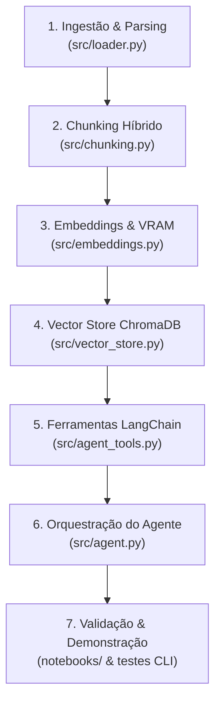

# MD1 - Mapa Macro do Projeto

> **Visão Geral:** Mapeamento cronológico de todas as etapas, módulos, funções e decisões de engenharia do pipeline RAG de Auditoria Parlamentar.  
> **Repositório Base:** [`unicamp-dl/PublicHearingBR`](https://huggingface.co/datasets/unicamp-dl/PublicHearingBR)

---

## 🗺️ Fluxo Geral de Execução

---

## 📋 Mapeamento Detalhado por Etapas

### 📦 ETAPA 1: Ingestão de Dados e Parsing Estruturado
* **Objetivo:** Baixar com segurança os arquivos grandes do Hugging Face Hub (via Git LFS), realizar o parsing dos arquivos JSONL e estruturar os DataFrames iniciais com métricas descritivas.
* **Arquivo Principal:** [`src/loader.py`](file:///home/rpcosta/Códigos/knownledge%20Lab/src/loader.py)
* **Funções e Componentes Chave:**
  * `download_public_hearing_dataset()`: Baixa os arquivos `PublicHearingBR_LDS.jsonl` (25 MB) e `PublicHearingBR_NLI.jsonl` (56 MB) do repositório `unicamp-dl/PublicHearingBR`. Se os arquivos já existirem localmente e forem válidos, pula o download.
  * `_read_jsonl()`: Leitor linha a linha de JSONL com tratamento de erros de parsing e decodificação UTF-8.
  * `load_lds_data()`: Carrega as 206 audiências e calcula em tempo de carga métricas descritivas (`char_count_transcricao`, `word_count_transcricao`, `char_count_materia`, `word_count_materia` e `compression_ratio`).
  * `load_nli_data(flatten=True)`: Faz o desaninhamento (*flattening*) da estrutura hierárquica do NLI, transformando o JSON complexo em 4.238 linhas tabulares (cada uma com uma opinião atômica, 4 chunks de contexto e os rótulos de alucinação humana e dos modelos sintéticos).
  * `_resolve_raw_dir()`: Garante a resolução automática de caminhos tanto a partir da raiz do projeto quanto dentro de `notebooks/`.

---

### ✂️ ETAPA 2: Fatiamento Híbrido (*Chunking*) e Sanitização
* **Objetivo:** Fatiar documentos extensos (que chegam a 147 mil palavras) preservando as falas de cada orador na Câmara, segmentar notícias e gerar objetos `Document` do LangChain com metadados tipados.
* **Arquivo Principal:** [`src/chunking.py`](file:///home/rpcosta/Códigos/knownledge%20Lab/src/chunking.py)
* **Funções e Componentes Chave:**
  * `SPEAKER_HEADER_RE` (Regex Taquigráfica): Expressão regular especializada para capturar cabeçalhos formais da Taquigrafia da Câmara dos Deputados (ex: `O SR. PRESIDENTE (Lucas Redecker. Bloco/PSDB - RS) -`).
  * `chunk_transcriptions_by_speaker()`: Fatiador híbrido que agrupa o texto por orador. Se a fala de um deputado exceder `max_tokens=800` (~3.200 caracteres), aciona automaticamente um *fallback* com `RecursiveCharacterTextSplitter` (overlap de 150 tokens) para respeitar o limite de contexto da LLM.
  * `chunk_news_articles()`: Fatia as matérias jornalísticas da Agência Câmara em blocos de 1.000 caracteres com 150 caracteres de sobreposição.
  * `chunk_nli_records()`: Converte cada registro desaninhado do NLI em um documento contendo a opinião do orador + seus 4 chunks contextuais + metadado booleano de fidelidade (`verificacao_manual`).
  * `_sanitize_metadata_value()`: Sanitiza valores nulos (`None`/`NaN`) convertendo-os em tipos primitivos compatíveis com o ChromaDB para evitar falhas de indexação.

---

### 🧠 ETAPA 3: Embeddings com Consciência de Hardware (*Hardware-Aware*)
* **Objetivo:** Instanciar o modelo de representação vetorial denso de alta performance, garantindo que ele não cause estouro de memória de GPU (*CUDA Out Of Memory*) e funcione em modo offline.
* **Arquivo Principal:** [`src/embeddings.py`](file:///home/rpcosta/Códigos/knownledge%20Lab/src/embeddings.py)
* **Funções e Componentes Chave:**
  * `get_embedding_model()`: Instancia o modelo multilíngue de ponta **`BAAI/bge-m3`** (janela de até 8.192 tokens e vetores densos de 1024 dimensões).
  * **Checagem Dinâmica de VRAM:** Consulta a GPU em tempo real via PyTorch. Caso a VRAM livre seja inferior a 3.5 GB, reverte automaticamente e com segurança para a CPU.
  * **Estratégia *Offline-First*:** Tenta carregar primeiro com `local_files_only=True` via cache do Hugging Face. Se não encontrar o modelo em disco, realiza o download sob demanda.
  * `@lru_cache(maxsize=1)`: Garante que o modelo pesado seja carregado apenas uma vez na memória durante todo o ciclo de vida do processo.

---

### 🗄️ ETAPA 4: Banco Vetorial Multi-Coleção e Indexação Idempotente
* **Objetivo:** Armazenar os vetores e metadados estruturados em disco (`notebooks/data/processed/chroma_db/`), distribuídos em 3 coleções independentes para permitir consultas segmentadas pelo agente.
* **Arquivo Principal:** [`src/vector_store.py`](file:///home/rpcosta/Códigos/knownledge%20Lab/src/vector_store.py)
* **Funções e Componentes Chave:**
  * `get_chroma_client()`: Inicializa o `chromadb.PersistentClient` apontando para o diretório centralizado de persistência.
  * `index_documents_in_collection()`:
    * Indexa as 3 coleções especializadas:
      1. `transcricoes_db` (21.925 chunks de falas oficiais)
      2. `noticias_db` (1.073 chunks de matérias da imprensa)
      3. `nli_metadados_db` (4.238 chunks de opiniões e auditoria)
    * **Idempotência:** Verifica a contagem existente de documentos na coleção antes de processar; se já estiver completa, pula a inserção e poupa tempo de inferência.
    * **Processamento em Lotes:** Divide os documentos em lotes de 100 com barra de progresso `tqdm` e chamadas a `torch.cuda.empty_cache()` para liberação contínua de memória da GPU.
    * **IDs Determinísticos:** Identificadores estruturados no formato `{tipo}_{doc_id}_b{batch_num}_{idx}` evitam duplicações acidentais.

---

### 🛠️ ETAPA 5: Ferramentas LangChain com Proteção Anti-Jinja
* **Objetivo:** Definir as funções que o Agente de IA pode invocar de forma autônoma (*Tool Calling*), com filtros dinâmicos de metadados e sanitização contra quebras de template.
* **Arquivo Principal:** [`src/agent_tools.py`](file:///home/rpcosta/Códigos/knownledge%20Lab/src/agent_tools.py)
* **Funções e Componentes Chave:**
  * `@tool buscar_fala_transcricao`: Executa busca vetorial em `transcricoes_db` com filtros opcionais por `orador` e `doc_id`.
  * `@tool buscar_noticia_agencia_camara`: Executa busca vetorial em `noticias_db` com filtro por `doc_id`.
  * `@tool buscar_opiniao_estruturada_nli`: Executa busca em `nli_metadados_db` com filtro booleano `apenas_alucinacoes`.
  * `_build_where_filter()`: Constrói a cláusula `{"$and": [...]}` do ChromaDB dinamicamente, ignorando parâmetros não fornecidos pelo agente.
  * `_sanitize_tool_text()`: Converte caracteres especiais como `{{` e `}}` em `{ {` e `} }`, prevenindo erros de sintaxe de templates Jinja2 no LM Studio / vLLM.

---

### 🤖 ETAPA 6: Orquestração do Agente RAG e Auditoria Cruzada
* **Objetivo:** Integrar a LLM local (via LM Studio / endpoint compatível com OpenAI) ao motor de raciocínio com Tool Calling, impondo diretrizes rígidas de fidelidade documental.
* **Arquivo Principal:** [`src/agent.py`](file:///home/rpcosta/Códigos/knownledge%20Lab/src/agent.py)
* **Funções e Componentes Chave:**
  * `SYSTEM_PROMPT`: Prompt de auditoria com 5 diretrizes invioláveis:
    1. **Uso Obrigatório de Ferramentas:** Proibido responder de memória sem consultar as ferramentas.
    2. **Auditoria Cruzada:** Obrigatoriedade de confrontar o que foi dito na transcrição com a matéria jornalística e a base NLI.
    3. **Citação Rígida de Metadados:** Citação explícita de `doc_id`, orador e cargo em todas as respostas.
    4. **Identificação de Divergências:** Rotulagem explícita de alucinações e distorções factuais.
    5. **Imparcialidade Técnica:** Tom profissional fundamentado em evidências.
  * `create_rag_agent()`: Instancia o cliente `ChatOpenAI` (`temperature=0.0`), configura o prompt com suporte a `chat_history` e instancia o `AgentExecutor` com tolerância a erros de parsing e limite de 5 iterações de raciocínio.

---

### 📊 ETAPA 7: Testes CLI, EDA e Notebooks de Demonstração
* **Objetivo:** Fornecer validação contínua de ponta a ponta e interfaces visuais para apresentação dos resultados.
* **Arquivos e Notebooks:**
  * [`test_step2.py`](file:///home/rpcosta/Códigos/knownledge%20Lab/test_step2.py): Script CLI que testa o fatiamento e metadados de 1 amostra de LDS e NLI.
  * [`test_step3.py`](file:///home/rpcosta/Códigos/knownledge%20Lab/test_step3.py): Script CLI que valida as 3 ferramentas de busca e a conectividade com o LM Studio.
  * [`notebooks/01_eda_public_hearing.ipynb`](file:///home/rpcosta/Códigos/knownledge%20Lab/notebooks/01_eda_public_hearing.ipynb): Análise exploratória com gráficos de distribuição de palavras/tokens, taxa de compressão e proporção de alucinações.
  * [`notebooks/02_vector_store_indexing.ipynb`](file:///home/rpcosta/Códigos/knownledge%20Lab/notebooks/02_vector_store_indexing.ipynb): Execução e inspeção visual da indexação vetorial no ChromaDB.
  * [`notebooks/03_rag_agent_chat.ipynb`](file:///home/rpcosta/Códigos/knownledge%20Lab/notebooks/03_rag_agent_chat.ipynb): Demonstração prática dos 3 casos de uso de auditoria e Chatbot interativo em loop.
