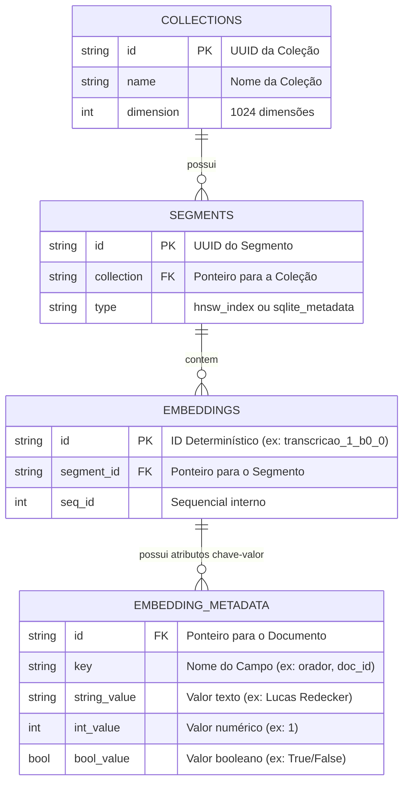

# MD2 - Estrutura e Esquema do Banco de Dados

> **Persistência Vetorial:** ChromaDB Persistent Client  
> **Local de Armazenamento:** `notebooks/data/processed/chroma_db/`  
> **Modelo de Embeddings:** `BAAI/bge-m3` (1.024 dimensões normalizadas)  
> **Total de Documentos Vetorizados:** **27.236 documentos**

---

## 🏛️ Visão Geral da Arquitetura de Dados

O banco de dados vetorial opera com **persistência local em disco** estruturada em dois níveis complementares:
1. **Esquema Lógico:** 3 coleções vetoriais independentes acessadas via LangChain / ChromaDB API.
2. **Esquema Físico Relacional:** Um catálogo relacional SQLite (`chroma.sqlite3`) para indexação de metadados tipados combinado com grafos de vizinhos mais próximos (**HNSW — Hierarchical Navigable Small World**).

```
                       ┌────────────────────────────────────────────────────────┐
                       │          ChromaDB (Multi-Collection Vector Store)       │
                       └───────────────────────────┬────────────────────────────┘
                                                   │
        ┌──────────────────────────────────────────┼──────────────────────────────────────────┐
        ▼                                          ▼                                          ▼
┌───────────────────────────────┐  ┌───────────────────────────────┐  ┌───────────────────────────────┐
│     transcricoes_db           │  │         noticias_db           │  │      nli_metadados_db         │
├───────────────────────────────┤  ├───────────────────────────────┤  ├───────────────────────────────┤
│ 21.925 documentos             │  │ 1.073 documentos              │  │ 4.238 documentos              │
│ • id: transcricao_1_b0_0      │  │ • id: noticia_1_b0_0          │  │ • id: nli_opinion_1_b0_0      │
│ • doc_id (int)                │  │ • doc_id (int)                │  │ • doc_id (int)                │
│ • orador (str)                │  │ • assunto (str)               │  │ • envolvido_nome (str)        │
│ • assunto (str)               │  │ • tipo = "noticia"            │  │ • cargo (str)                 │
│ • tipo = "transcricao"        │  │ • page_content: Matéria       │  │ • verificacao_manual (bool)   │
│ • page_content: Fala          │  └───────────────────────────────┘  │ • tipo = "nli_opinion"        │
└───────────────────────────────┘                                     │ • page_content: Opinião+Chunk │
                                                                      └───────────────────────────────┘
```

---

## 1. Esquema Lógico das Coleções

### 🔹 Coleção 1: `transcricoes_db` (21.925 registros)
Armazena as falas individuais de deputados, ministros, presidentes e convidados registradas na Taquigrafia oficial da Câmara dos Deputados.

| Campo | Tipo | Descrição | Exemplo de Valor |
| :--- | :--- | :--- | :--- |
| `id` | `str` (PK) | Identificador determinístico do chunk | `"transcricao_1_b0_0"` |
| `page_content` | `str` | Texto integral da fala ou sub-chunk do orador | `"O SR. PRESIDENTE (Lucas Redecker...) - Muito boa tarde..."` |
| `embedding` | `List[float]` (1024 dims) | Vetor denso gerado pelo modelo `BAAI/bge-m3` | `[0.0182, -0.0451, ..., 0.0219]` |
| `metadata.doc_id` | `int` | ID numérico da audiência pública | `1` |
| `metadata.orador` | `str` | Nome formal do orador, partido e estado | `"O SR. PRESIDENTE(Lucas Redecker. Bloco/PSDB - RS)"` |
| `metadata.assunto` | `str` | Pauta temática da audiência pública | `"Acusações de censura e bloqueio de redes sociais..."` |
| `metadata.tipo` | `str` | Rótulo da fonte documental | `"transcricao"` |

---

### 🔹 Coleção 2: `noticias_db` (1.073 registros)
Armazena a cobertura jornalística resumida produzida pela Agência Câmara de Notícias.

| Campo | Tipo | Descrição | Exemplo de Valor |
| :--- | :--- | :--- | :--- |
| `id` | `str` (PK) | Identificador determinístico do chunk | `"noticia_1_b0_0"` |
| `page_content` | `str` | Bloco textual da matéria (1.000 caracteres) | `"Jornalistas acusam Alexandre de Moraes de censura..."` |
| `embedding` | `List[float]` (1024 dims) | Vetor denso gerado pelo modelo `BAAI/bge-m3` | `[-0.0125, 0.0384, ..., -0.0091]` |
| `metadata.doc_id` | `int` | ID da audiência pública correspondente | `1` |
| `metadata.assunto` | `str` | Pauta temática da matéria | `"Acusações de censura e bloqueio de redes sociais..."` |
| `metadata.tipo` | `str` | Rótulo da fonte documental | `"noticia"` |

---

### 🔹 Coleção 3: `nli_metadados_db` (4.238 registros)
Armazena declarações atômicas de parlamentares com anotações de auditoria e *ground truth* humano de fidelidade documental vs. alucinação.

| Campo | Tipo | Descrição | Exemplo de Valor |
| :--- | :--- | :--- | :--- |
| `id` | `str` (PK) | Identificador determinístico do chunk | `"nli_opinion_1_b0_0"` |
| `page_content` | `str` | Declaração do orador + 4 Chunks textuais de contexto | `"Opinião (Lucas Redecker...): Destacou a importância...\n\nContexto:\n..."` |
| `embedding` | `List[float]` (1024 dims) | Vetor denso gerado pelo modelo `BAAI/bge-m3` | `[0.0311, -0.0142, ..., 0.0512]` |
| `metadata.doc_id` | `int` | ID da audiência pública | `1` |
| `metadata.envolvido_nome` | `str` | Nome do declarante | `"Lucas Redecker"` |
| `metadata.cargo` | `str` | Cargo institucional do declarante | `"Presidente da Comissão de Relações Exteriores..."` |
| `metadata.verificacao_manual` | `bool` | *Ground truth* de fidelidade (`True`=Fiel, `False`=Alucinação) | `False` |
| `metadata.tipo` | `str` | Rótulo da fonte documental | `"nli_opinion"` |

---

## 2. Esquema Físico Relacional (`chroma.sqlite3` + HNSW)

Fisicamente, os dados residem sob o diretório `notebooks/data/processed/chroma_db/`:
* **`chroma.sqlite3`:** Banco relacional SQLite que gerencia o catálogo e metadados tipados.
* **Pastas UUID (ex: `80bbd091-...`):** Contêm os grafos vetoriais HNSW compilados em formato binário para busca de vizinhos mais próximos em tempo sub-milissegundo.

### 2.1. Diagrama Entidade-Relacionamento (ERD)



### 2.2. Contagem de Linhas por Tabela SQLite

| Tabela no SQLite | Total de Linhas | Função no Sistema |
| :--- | :---: | :--- |
| **`collections`** | **3** | Mapeamento das 3 coleções e seus UUIDs. |
| **`segments`** | **6** | Mapeamento dos segmentos de metadados e grafos HNSW. |
| **`embeddings`** | **27.236** | Catálogo completo de documentos indexados. |
| **`embedding_metadata`** | **139.345** | Tabela tipada (`string_value`, `int_value`, `bool_value`) com índice B-Tree para filtros rápidos `where`. |
| **`embedding_fulltext_search`** | — | Índice virtual FTS5 do SQLite para pesquisas textuais exatas. |

---

## 3. Padrão de IDs Determinísticos

Para garantir **idempotência total** e evitar duplicações caso uma indexação seja interrompida, todos os documentos possuem IDs estruturados:

$$\mathbf{id} = \text{\{tipo\}\_\{doc\_id\}\_b\{batch\_num\}\_\{idx\}}$$

* **Exemplo Transcrição:** `transcricao_1_b0_0` *(audiência 1, lote 0, 1º documento)*
* **Exemplo Notícia:** `noticia_1_b0_0` *(audiência 1, lote 0, 1º documento)*
* **Exemplo NLI:** `nli_opinion_1_b0_0` *(audiência 1, lote 0, 1ª opinião)*

---

## 4. Consultas e Inspeção do Banco

### 4.1. Consulta via Python / Pandas (Recomendado)
```python
import chromadb
import pandas as pd

client = chromadb.PersistentClient(path="notebooks/data/processed/chroma_db")
col = client.get_collection("nli_metadados_db")

data = col.peek(limit=5)
df = pd.DataFrame({
    "id": data["ids"],
    "envolvido": [m.get("envolvido_nome") for m in data["metadatas"]],
    "cargo": [m.get("cargo") for m in data["metadatas"]],
    "fiel": [m.get("verificacao_manual") for m in data["metadatas"]],
    "doc_id": [m.get("doc_id") for m in data["metadatas"]]
})
display(df)
```

### 4.2. Consulta SQL Relacional Direta (`chroma.sqlite3`)
```sql
SELECT 
    c.name AS colecao,
    e.id AS doc_id,
    em.key AS metadado_chave,
    COALESCE(em.string_value, CAST(em.int_value AS TEXT), CAST(em.bool_value AS TEXT)) AS valor
FROM collections c
JOIN segments s ON s.collection = c.id
JOIN embeddings e ON e.segment_id = s.id
JOIN embedding_metadata em ON em.id = e.id
WHERE c.name = 'transcricoes_db'
  AND em.key = 'orador'
  AND em.string_value LIKE '%Marcel van Hattem%'
LIMIT 10;
```
